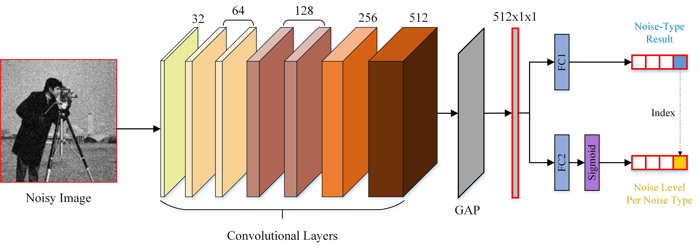

# DKPNet
Code for paper 'Multinoise-type blind denoising using a single uniform deep convolutional neural network'  
--------------------
[paper link](http://dx.doi.org/10.1117/1.JEI.29.4.043020)

Use the script **train_script_model_multi.sh** and **eval_script_multi.sh** to train/evaluate our network.

Several pre-trained model files are provided in **./checkpoint/model_pool**. 
 

NOTICE:
----- 

1. Our work was done in the following environment: Python 3.6.8, Pytorch 1.1.0, cuda 10.0, cudnn 7.6.5.
2. We used BSD500 as our training and validation datasets. Remember to change the directory in the script according to your own dataset location. 
3. Since the noise estimation sub-network is rather simple, we provide the pretrained model as in **1.pth**. You can simply load it while training the denoising sub-network.
4. The post-fix **_est** represents the use of the noise estimation sub-network. No post-fix means the noise estimation sub-network is not included in the training/evaluation, and we use the groud-truth noise-type and noise-level information instead.

Quick Introduction
---
An image-denoising network based on noise-level and -type estimation was proposed, with the objective of solving the blind-denoising problem for various noises using a single cascaded network. The algorithm used a two-step method. First, a noise-estimation CNN was used to estimate the noise-type and -level information in the noisy image. Then, during the second stage, the obtained estimation results were spliced as additional channels of the input image and fed to the denoising network. To better utilize the noise information, the denoising network used the concept of filter flow to adopt a two-way parallel network structure, where an extra filter branch adaptively activated local features applicable to the estimated information.

Overall Network Structure:
---

Noise Estimation Sub-network:
----

Denoising Sub-network:
----

Denoising performance (PSNR/SSIM) on Set14 and BSD200.
----
Set14:

Noise Type|	Noise Level|	BM3D|	DnCNN|	DnCNN+(TI)|	DnCNN+|	MBDNet(TI)|	MBDNet
-|-|-|-|-|-|-|-
Gaussian|	30|	28.02/0.7744|	28.83/0.8204|	29.01/0.8268|	28.97/0.8258|	29.11/0.8285|	29.06/0.8269
Gaussian|	50|	25.26/0.6878|	26.27/0.7357|	26.56/0.7524|	26.52/0.7508|	26.65/0.7551|	26.62/0.7545
Random-Impulse|	30|	17.06/0.3547|	31.56/0.9384|	31.96/0.9420|	31.84/0.9418|	32.23/0.9426|	32.23/0.9427
Random-Impulse|	50|	17.09/0.4141|	27.51/0.8672|	27.71/0.8752|	27.66/0.8736|	28.00/0.8791|	28.02/0.8789
Salt-and-Pepper|	30|	11.48/0.1056|	35.29/0.9680|	35.73/0.9697|	35.74/0.9698|	35.96/0.9699|	36.02/0.9700
Salt-and-Pepper|	50|	11.05/0.0717|	32.00/0.9368|	32.26/0.9401|	32.30/0.9402|	32.47/0.9409|	32.45/0.9410
Poisson|	50|	27.77/0.7550|	31.96/0.8876|	32.22/0.8913|	32.10/0.8860|	32.28/0.8916|	32.21/0.8886

BSD200:

Noise Type|	Noise Level|	BM3D|	DnCNN|	DnCNN+(TI)|	DnCNN+|	MBDNet(TI)|	MBDNet
-|-|-|-|-|-|-|-
Gaussian|	30|	27.74/0.7605|	27.86/0.7757|	28.02/0.7855|	27.85/0.7786|	28.06/0.7849|	27.95/0.7805
Gaussian|	50	25.31/0.6673|	25.65/0.6810|	25.83/0.6911|	25.74/0.6873|	25.88/0.6940|	25.83/0.6911
Random-Impulse|	30|	17.85/0.3682|	30.62/0.9156|	30.81/0.9192|	30.79/0.9187|	30.98/0.9203|	30.95/0.9201
Random-Impulse|	50|	17.97/0.4294|	27.08/0.8191|	27.26/0.8281|	27.22/0.8265|	27.41/0.8314|	27.40/0.8307
Salt-and-Pepper|	30|	11.71/0.1102|	34.55/0.9611|	34.92/0.9637|	34.91/0.9635|	34.93/0.9625|	34.92/0.9626
Salt-and-Pepper|	50|	11.32/0.0745|	31.14/0.9174|	31.37/0.9215|	31.37/0.9213|	31.46/0.9206|	31.45/0.9206
Poisson|	50|	27.11/0.7196|	31.32/0.8821|	31.44/0.8847|	31.24/0.8734|	31.40/0.8841|	31.30/0.8761

Visual Performance
-----

***
(a) Ground Truth; (b) Noisy Image; Denoised image from model (c) BM3D; (d) DnCNN; (e) DnCNN+(TI); (f) MBDNet; (g) MBDNet(TI) 
***TI*** represents we use the ground-truth noise information instead of the estimation results; 

Runtime
------
Runtime tested on our computer environment is listed below. 
**DnCNN:** *4.47ms* 
**DnCNN+:** *1.46ms*(estimation)+*4.87ms*(denoising) 
**MBDNet:** *1.46ms*(estimation)+*5.48ms*(denoising) 